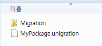

Unigration
=====

<sub>거지같은</sub> Unity의 패키지 마이그레이션을 도와주는 도구.

Usage
----
아래와 같이 패키지용 xml 파일을 생성한 후, package_name.unigration 파일로 저장합니다. 이 파일은 Assets 하위에 있으면 어느 경로에 두던지 괜찮습니다.
```xml
<UnigrationNode>
  <name>MyPackage</name>
  <container>MyPackage.Migration</container>
  <path></path>
  <version>1.0.0</version>
</UnigrationNode>
```
* __name__ : 패키지 이름입니다. 이 값은 식별자입니다.
* __container__ : 마이그레이션 스크립트들을 담고있는 Namespace의 이름입니다.
* __version__ : 패키지의 버전입니다.
<br>
시작 버전을 1.0.0으로 설정하였으니, 1.1.0으로 마이그레이션하는 스크립트를 작성해 보겠습니다.<br>
패키지 안에 Migration 폴더를 만듭니다. (경로나, 폴더 자체 이름은 중요하지 않습니다.)
<br>
<br>

해당 폴더 안에 `Ver_1_1_0.cs`파일을 생성하고, 아래와 같이 채워넣습니다.
```c#
// 네임스페이스를 반드시 xml에서 지정한 container값과 동일하게 맞춰야 합니다.
namespace MyPackage.Migration
{
  // 클래스 이름은 반드시 '이름_x_x_x' 형태로 지어야 합니다.
  // Unigration은 클래스 이름을 기반으로 버전을 유추합니다.
	public class Ver_1_1_0
	{
        public static void Up(string old)
        {
            /* UP */
        }

        public static void Since(string old)
        {
            /* SINCE */
        }
	}
}
```
__Up__ 메소드는 이번 버전에 대해 마이그레이션이 실행될 때 호출됩니다.<br>
__Since__ 는 해당 버전부터 마이그레이션이 실행될 때 마다 계속 호출됩니다.<br>
<br>
예를들어, 현재 버전이 `1.0.0`일 때, 새로운 `1.1.0`버전의 패키지가 임포트 될 때, `1.1.0`의 __Up__, __Since__ 메소드가 모두 실행됩니다.<br>
이후 `1.2.0`버전이 임포트 될 경우에는 `1.2.0` 버전에 대해서는 __Up__, __Since__ 모두, `1.1.0` 버전에서는 __Since__ 메소드만 호출됩니다. (`1.1.0`으로의 마이그레이션이 일어난것이 아니기 때문에 __Up__은 호출되지 않습니다.)<br>
<br>
두 메소드 모두 인자로 마이그레이션 하기 이전 버전이 전달됩니다.<br>
<br>
* 아래 방향의 마이그레이션은 지원하지 않습니다. <sub>이게 무슨 db도 아니고</sub>

Download
----
* [Unigration.unitypackage](Unigration.unitypackage)